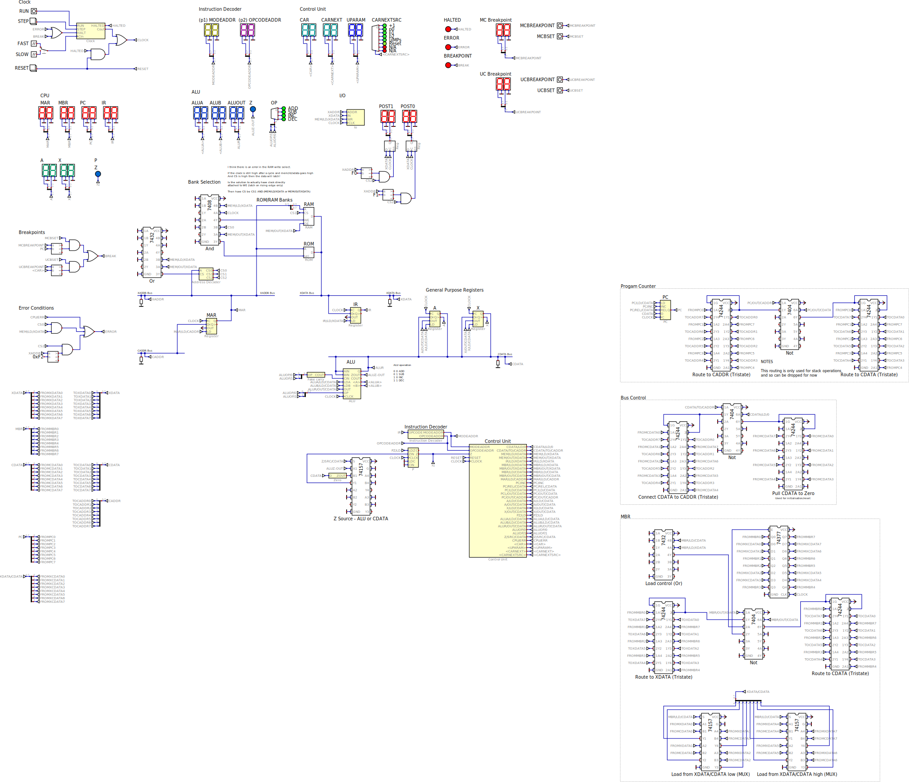

# DIY CPU Simplified

A version of [DIY CPU](https://github.com/skagra/diy-cpu-meta) simplified to reduce the chip count and bus line count such that it is more straightforward to
implement physically on protoboard.

The repository contains:

* Designs and emulations of the [CPU using generic components](digital/generic/).
* Realizations and emulations of the [CPU using the `74HC` series of ICs](digital/74x/).
* [μcode](ucode) implementing a subset of the 6502 instruction set which runs on both the emulated CPU and the physical CPU.  The μcode uses the [μcode-assembler](https://github.com/skagra/diy-cpu-uc-assembler) created for this project. 
* Hardware designs.

