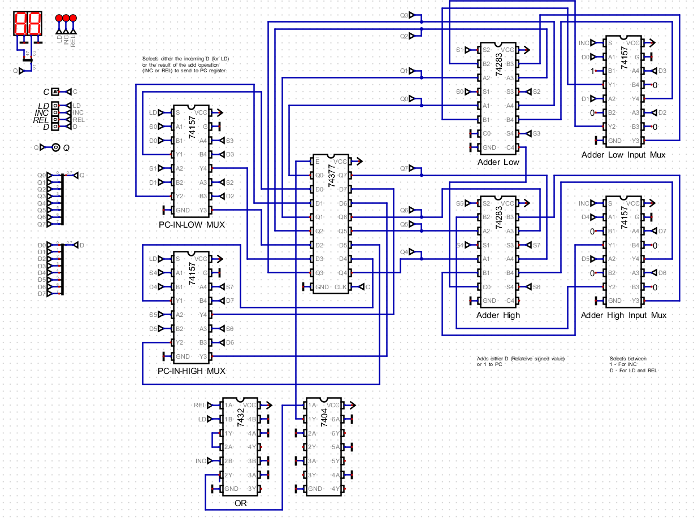

<div name="top"></div>

# 74xx Designs and Physical Implementations

- [74xx Designs and Physical Implementations](#74xx-designs-and-physical-implementations)
- [Top Level CPU Design](#top-level-cpu-design)
- [8 Bit Bus](#8-bit-bus)
- [Power](#power)
- [Registers](#registers)
- [ALU](#alu)
- [P](#p)
- [Zero](#zero)
- [Carry](#carry)
- [Zero Selection](#zero-selection)
- [MBR](#mbr)
- [Bus Bridge](#bus-bridge)
- [Program ROM](#program-rom)
- [Display](#display)
- [Program Counter](#program-counter)


# Top Level CPU Design


[Top](#top)

# 8 Bit Bus 

All 8-bit bus connections have this layout where `0` => LSB and `7` => MSB.

|     |     |     |     |
| --- | --- | --- | --- |
| `7` | `6` | `5` | `4` |
| `3` | `2` | `1` | `0` |

[Top](#top)

# Power

All boards have power connections as follows:

|       |       |
| ----- | ----- |
| `+5V` | `GND` |

[Top](#top)

# Registers

A common board is used for `ACC` (Accumulator), `X` (X Register) and `MAR` (Memory Address Register).  


## Layout

|          |           |                 |         |
| -------- | --------- | --------------- | ------- |
| `Bus-In` | `Bus-Out` | `Control-Lines` | `Power` |

## Control lines

|       |      |       |
| ----- | ---- | ----- |
| `CLK` | `LD` | `OUT` |

## Connections

### ACC

The accumulator.

```
Bus-In  -> CDATA

Bus-Out -> CDATA

CLK     -> CLOCK_OUT 
LD      -> A_LD_CDATA from the Control Unit
OUT     -> A_OUT_CDATA from the Control Unit
```

### X

General purpose `X` register.

```
Bus-In  -> CDATA

Bus-Out -> CDATA

CLK     -> CLOCK_OUT
LD      -> X_LD_CDATA from the Control Unit
OUT     -> X_OUT_CDATA from the Control Unit
```

### MAR

The *Memory Address Register* (`MAR` ) holds the address of data to be retrieved by the CPU from memory.

```
Bus-In  -> CADDR

Bus-Out -> XADDR

CLK     -> CLOCK_OUT
LD      -> MAR_LD_CDATA from the Control Unit
OUT     -> HIGH
```

[Top](#top)

# ALU

The *Arithmetic Logic Unit* (`ALU`) implements add, subtract, increment and decrement function.


## Layout

|                                 |            |                            |                            |
| ------------------------------- | ---------- | -------------------------- | -------------------------- |
| `A-In-Bus`                      | `B-In-Bus` | `Control-Lines`            | `Power`                    |
|                                 |            | `A-Out-Bus` *(unbuffered)* | `B-Out-Bus` *(unbuffered)* |
| `Result-Out-Bus`                |            |                            |                            |
| `Result-Out-Bus` *(unbuffered)* |            |                            |                            |

## Control Lines

|       |       |       |        |
| ----- | ----- | ----- | ------ |
| `LDA` | `LDB` | `CIN` | ~~NC~~ |
| `OP1` | `OP0` | `OUT` | `CLK`  |

## Operations

| Operation | OP1 | OP0 |
| --------- | --- | --- |
| `ADD`     | `0` | `0` |
| `SUB`     | `0` | `1` |
| `INC`     | `1` | `0` |
| `DEC`     | `1` | `1` |

## Connections

```
A-Bus-In                    -> CDATA

B-Bus-In                    -> CDATA

A-Out-Bus (unbuffered)      -> N/A

B-Out-Bus (unbuffered)      -> N/A

Result-Out-Bus              -> CDATA

Result-Out-Bus (unbuffered) -> 

LDA                         -> ALUA_LD_CDATA
LDB                         -> ALUB_LD_CDATA
CIN                         -> COUT from the carry board
OP1                         -> ALUOP_1 via the carry board
OP0                         -> ALUOP_0 via the carry board
OUT                         -> ALUR_OUT_CDATA
CLK                         -> CLOCK_OUT
```
[Top](#top)

# P

The status register (`P`) holds up to 4 CPU status flags, currently only a zero `Z` flag is stored.  The design shows a carry flag being stored but this is not reflected by the current physical implementation.


## Layout

|                 |      |       |         |
| --------------- | ---- | ----- | ------- |
| `Control-Lines` | `In` | `Out` | `Power` |

## Control Lines

|        |        |        |       |     |        |        |        |        |     |        |        |        |        |
| ------ | ------ | ------ | ----- | --- | ------ | ------ | ------ | ------ | --- | ------ | ------ | ------ | ------ |
| ~~NC~~ | ~~NC~~ | ~~NC~~ | `CLK` |     | ~~NC~~ | ~~NC~~ | ~~NC~~ | ~~NC~~ |     | ~~NC~~ | ~~NC~~ | ~~NC~~ | ~~NC~~ |
| `LD3`  | `LD2`  | `LD1`  | `LD0` |     | `IN3`  | `IN2`  | `IN1`  | `IN0`  |     | `OUT3` | `OUT2` | `OUT1` | `OUT0` |

## Connections

```
CLK  -> CLOCK_OUT
LD3  -> N/A
LD2  -> N/A
LD1  -> N/A
LD0  -> PZ_LD from the Control Unit

IN3  -> N/A
IN2  -> N/A
IN1  -> N/A
IN0  -> OUT from Zero Selection board

OUT3 -> N/A
OUT2 -> N/A
OUT1 -> N/A
OUT0 -> PZ_IN on the Control Unit
```
[Top](#top)

# Zero

The `zero` boards simply test whether an 8 bit input is equal to zero.


There are two slightly different board layouts.

## Layout 1

|          |           |         |
| -------- | --------- | ------- |
| `Bus-In` | `Bus-Out` | `Power` |
|          |           | `ZOUT`  |

## Layout 2

|          |        |         |
| -------- | ------ | ------- |
| `Bus-In` | `ZOUT` | `Power` |

## Connections #1

```
Bus-In  -> Result-Out-Bus (unbuffered) from the ALU

Bus-Out -> N/A

ZOUT    -> INA on the Zero Selection board
```

## Connections #2

```
Bus-In -> CDATA

ZOUT   -> INB on the Zero Selection board
```
[Top](#top)

# Carry

The CPU does not currently have a full implementation of a carry flag.  However the `ALU` requires a carry input for correct operations.   The carry board fakes up a carry flag based on the arithmetic operation - subtraction causes carry to be set.  The board also has a passes through the lines defining the arithmetic operation for easy chaining to the ALU.  


## Layout

|                 |         |
| --------------- | ------- |
| `Control-Lines` | `Power` |

## Control Lines

|          |          |        |
| -------- | -------- | ------ |
| `OP1IN`  | `OP0IN`  | ~~NC~~ |
| `OP1OUT` | `OP0OUT` | `COUT` |

## Connections

```
OP1IN  -> ALUOP_1 from the Control Unit
OP0IN  -> ALUOP_0 from the Control Unit
OP1OUT -> OP1 on the ALU board
OP0OUT -> OP0 on the ALU board
COUT   -> CIN on the ALU board
```

[Top](#top)

# Zero Selection

The *zero selection* board routes a routes either the zero value from the `CDATA` bus or that from `ALU` to the *status register* (`P`).


## Layout

|                 |         |
| --------------- | ------- |
| `Control-Lines` | `Power` |

## Control Lines

|          |       |       |       |
| -------- | ----- | ----- | ----- |
| `OUTSEL` | `INA` | `INB` | `OUT` |

## Connections

```
OUTSEL    -> Z-SRC_CDATA from Control Unit.  LOW => INA HIGH => INB
INA       -> A-Out-Bus (unbuffered) from ALU
INB       -> CDATA
OUT       -> IN0 on the P (status register) board
```
[Top](#top)

# MBR

The Memory Buffer Register (`MBR`) holds data to be written memory to or that has been read from memory.


## Layout

|                |                |                  |         |
| -------------- | -------------- | ---------------- | ------- |
| `Bus-In-Out-A` | `Bus-B-In-Out` | `Control-Lines ` | `Power` |
|                |

## Control Lines

|       |       |        |        |       |
| ----- | ----- | ------ | ------ | ----- |
| `LDA` | `LDB` | `OUTA` | `OUTB` | `CLK` |

## Connections

```
Bus-A-In-Out -> CDATA

Bus-B-In-Out -> XDATA

LDA          -> MBR_LD_CDATA from the Control Unit
LDB          -> MBR_LD_XDATA from the Control Unit
OUTA         -> MBR_OUT_DATA from the Control Unit
OUTB         -> MBR_OUT_XDATA from the Control Unit
CLK          -> CLOCK_OUT
```
[Top](#top)

# Bus Bridge

The *Bus Bridge* allows the `CDATA` bus to be connected to the `CADDR` bus.


## Layout

|          |           |                 |         |
| -------- | --------- | --------------- | ------- |
| `Bus-In` | `Bus-Out` | `Control Lines` | `Power` |

## Control Lines

|       |
| ----- |
| `OUT` |

## Connections

```
Bus-In  -> CDATA

Bus-Out -> CADDR

OUT     -> CDATA_TO_CADDR from the Control Unit
```
[Top](#top)

# Program ROM

The *Program ROM* (an [`AT28C64B`](https://github.com/skagra/diy-cpu-meta/blob/main/docs/datasheets/memory/doc0270.pdf) IC) holds the machine code program to be executed by the CPU.

Unused address pins (`A8`->`A12`) are tied `LOW`, `~WE` (*write enable*) is tied `HIGH`, `~CE` (*chip enable*) is tied `LOW`.

## Layout

|            |            |                 |
| ---------- | ---------- | --------------- |
| `ADDR-Bus` | `DATA-Bus` | `Control-Lines` |

## Control Lines

|       |
| ----- |
| `~OE` |

## Connections

```
ADDR-BUS -> XADDR
DATA-Bus -> XDATA
~OE       -> MEM_OUT_XDATA from the Control Unit (the Progam ROM board inverts the value)
```

[Top](#top)

# Display

A simple memory mapped display - able to to display two numerical values and one scrolling textual message, details are available [here](https://github.com/skagra/diy-display).


## Control Lines

|                     |            |          |             |
| ------------------- | ---------- | -------- | ----------- |
| `Addr-Bus` (2 bits) | `Data-Bus` | `ENABLE` | `INTERRUPT` |

Values on the `Addr-Bus` define the target display as follows:

| Value | Operation       |
| ----- | --------------- |
| `00`  | Digital value 1 |
| `01`  | Digital value 2 |
| `10`  | Textual message |
| `11`  | ~~NC~~          |

[Top](#top)

## Connections

```
Addr-Bus (2 bits) -> Low two bits of XADDR bus.
Data-Bus          -> XDATA
ENABLE            -> MEM_LD_XDATA
INTERRUPT         -> CLOCK_OUT
```

## Address Decoder

The address decoder selects a bank of memory based on an input address, as follows:

| Low  | Hi   | Range | Pin   | Description |
| ---- | ---- | ----- | ----- | ----------- |
| `F0` | `FF` | `0F`  | `CS2` | I/O         |
| `E0` | `EF` | `0F`  | `CS1` | RAM         |
| `00` | `DF` | `DF`  | `CS0` | ROM         |

*The above ranges require review.*   This address decoder, as yet, does not exist in hardware which assumes writes are to memory mapped output and reads are from ROM.


[Top](#top)

# Program Counter

The *Program Counter* (`PC`) holds the address of the current machine code instruction.



The PC, as yet, does not exist in hardware.  Its function is implemented in the μcontroller based [Control Unit](https://github.com/skagra/diy-cpu-controller).

[Top](#top)

